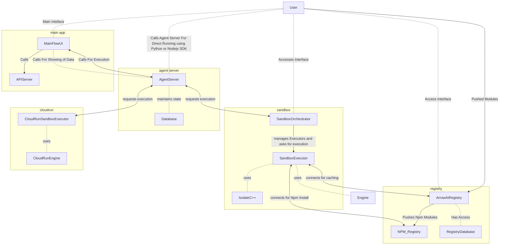

# ArrowAgent Executor

This is the Main Repository for Executing the ArrowAI workflows.

## Structure

The Repository consists of 
1. **Engines**

Engines are Executors that take the Workflows and Execute them. 
The Engines can run inside multiple Structures. 

  - **Isolate Engine**

The Isolate Engine is Variant of Engine that runs on ArrowAI CodeSandbox.

2. **Agent Server**

Agent Server is something where you ask for the Execution of the Flow. The Agent Server will be having its own Database where it maintains the flow state and other variables.

## External Application Usage

1. **Sandbox Orchestrator**

The Sandbox Executor is one that manages the Orchestration of Sandboxes on Things like Kubernetes. The Structure of Sandbox Orchestrator is that it has individual Executor and handles the Execution.

2. **Individual sandbox Executor**

The Individual sandbox Executor is the one that is responsible for the Execution of the Flow. This can be directly called by the Agent Server.

3. **Cloud Run Sandbox Executor** 

This is something that handles the Execution of the Flow on Google Cloud Run.

